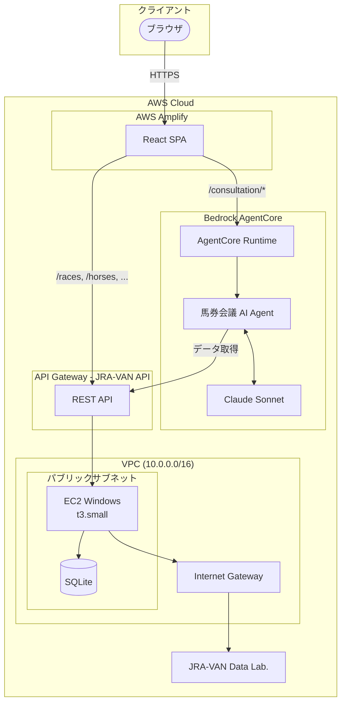
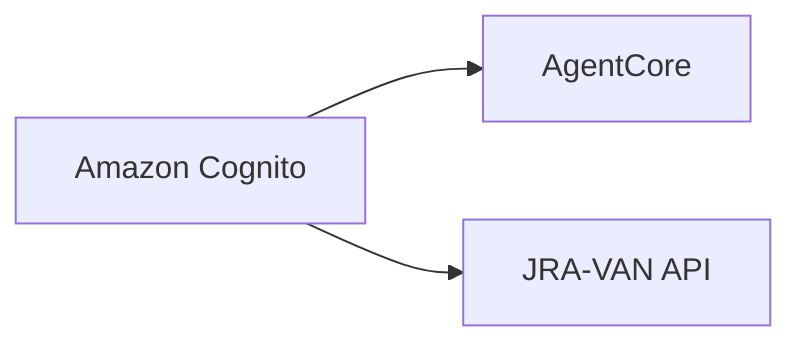

# システムアーキテクチャ

## 概要

馬券会議システムのインフラ構成。
AI 相談機能には **Amazon Bedrock AgentCore** を採用し、インフラ管理なしでエージェントをデプロイ。
JRA-VAN Data Lab. 連携は EC2 Windows 上の FastAPI サーバーで実現。

## アーキテクチャ図



## コンポーネント

### フロントエンド (AWS Amplify)

| 項目 | 値 |
|------|-----|
| フレームワーク | React + TypeScript + Vite |
| ホスティング | AWS Amplify |
| 状態管理 | Zustand (カート: ローカルストレージ永続化) |

### AI 相談 (Bedrock AgentCore)

| 項目 | 値 |
|------|-----|
| サービス | Amazon Bedrock AgentCore Runtime |
| AIモデル | Claude Sonnet (Anthropic) |
| デプロイ方式 | Direct Code Deployment (Python) |
| セッション管理 | AgentCore Memory |

#### AgentCore の利点

- **インフラ管理不要**: Lambda/API Gateway の設定が不要
- **自動スケーリング**: トラフィックに応じて自動拡張
- **セッション隔離**: 各ユーザーセッションが独立した microVM で実行
- **Claude 統合済み**: Anthropic モデルを直接利用可能
- **簡単デプロイ**: `agentcore deploy` コマンドで完了

#### エージェント機能

| 機能 | 説明 |
|------|------|
| 相談開始 | カート内容を分析し、データフィードバックを生成 |
| メッセージ送受信 | ユーザーとの対話（クイックリプライ対応） |
| 買い目分析 | オッズ・過去成績・騎手データを基に客観的分析 |
| 掛け金フィードバック | 責任あるギャンブルの観点からアドバイス |

### JRA-VAN API (API Gateway + EC2)

| 項目 | 値 |
|------|-----|
| API Gateway | REST API (CORS 設定済み) |
| バックエンド | EC2 Windows + FastAPI |
| データベース | SQLite (ローカルファイル) |

#### エンドポイント

**レース関連**

| メソッド | パス | 説明 |
|----------|------|------|
| GET | /races | レース一覧取得 |
| GET | /races/{race_id} | レース詳細取得 |
| GET | /races/{race_id}/runners | 出走馬一覧取得 |

**馬関連** (将来実装)

| メソッド | パス | 説明 |
|----------|------|------|
| GET | /horses/{horse_id} | 馬の詳細情報 |
| GET | /horses/{horse_id}/performances | 過去成績一覧 |

**騎手関連** (将来実装)

| メソッド | パス | 説明 |
|----------|------|------|
| GET | /jockeys/{jockey_id} | 騎手の詳細情報 |
| GET | /jockeys/{jockey_id}/stats | コース別成績 |

**システム**

| メソッド | パス | 説明 |
|----------|------|------|
| GET | /health | ヘルスチェック |
| GET | /sync-status | 同期状態確認 |

### EC2 Windows (JRA-VAN 連携)

| 項目 | 値 |
|------|-----|
| インスタンスタイプ | t3.small (2 vCPU, 2 GiB) |
| OS | Windows Server 2022 |
| 配置 | パブリックサブネット + Elastic IP |
| 用途 | JV-Link (32bit COM) + FastAPI サーバー |

#### データ同期

```bash
# JV-Link からデータを同期 (Windows 上で実行)
python sync_jvlink.py        # 差分同期
python sync_jvlink.py --full # 全データ同期
```

## ネットワーク設計

### VPC

| 項目 | 値 |
|------|-----|
| CIDR | 10.0.0.0/16 |
| リージョン | ap-northeast-1 |

### セキュリティグループ

#### EC2 用 SG

| 方向 | ポート | ソース/宛先 | 用途 |
|------|--------|-------------|------|
| インバウンド | 8000 | API Gateway | JRA-VAN API (FastAPI) |
| インバウンド | 3389 | 管理用 IP | RDP |
| アウトバウンド | 443 | 0.0.0.0/0 | JRA-VAN Data Lab., Windows Update |

## コスト見積もり

| リソース | 月額コスト |
|----------|-----------|
| **Amplify** | ビルド時間 + リクエスト数による（低コスト） |
| **AgentCore Runtime** | 実行時間による |
| **Claude API** | トークン数による |
| **API Gateway** | リクエスト数による |
| **EC2 t3.small** | ~$15 |
| **EBS 50GB gp3** | ~$5 |
| **Elastic IP** | ~$4 (EC2 停止時のみ) |
| **合計** | **約 $25-40/月** (使用量による) |

## デプロイ手順

### 1. AgentCore エージェントのデプロイ

```bash
# CLI インストール
pip install bedrock-agentcore-starter-toolkit

# エージェント作成
cd backend/agentcore
agentcore create

# ローカルテスト
agentcore dev
agentcore invoke --dev '{"prompt": "テスト"}'

# デプロイ
agentcore deploy
```

### 2. フロントエンドのデプロイ

```bash
# Amplify にプッシュ
git push origin main
# Amplify が自動ビルド・デプロイ
```

### 3. EC2 の設定

```bash
# JV-Link データ同期 (Windows 上)
python sync_jvlink.py --full

# FastAPI サーバー起動
python -m uvicorn main:app --host 0.0.0.0 --port 8000
```

## 環境変数

### フロントエンド (.env)

| 変数名 | 値 | 説明 |
|--------|-----|------|
| VITE_API_BASE_URL | https://xxx.execute-api.ap-northeast-1.amazonaws.com/prod | JRA-VAN API URL |
| VITE_AGENTCORE_ENDPOINT | https://xxx.bedrock-agentcore.amazonaws.com | AgentCore エンドポイント |

### AgentCore エージェント

| 変数名 | 値 | 説明 |
|--------|-----|------|
| JRAVAN_API_URL | https://xxx.execute-api.ap-northeast-1.amazonaws.com/prod | JRA-VAN API URL |
| CLAUDE_MODEL | claude-sonnet-4-20250514 | 使用する Claude モデル |

## 将来の拡張

### Phase 2: 認証機能



- Amazon Cognito によるユーザー認証
- AgentCore Identity との連携
- ユーザー別の損失上限管理

### Phase 3: 履歴・分析機能

- DynamoDB での購入履歴保存
- 損益サマリ計算
- AgentCore Memory による会話履歴永続化
