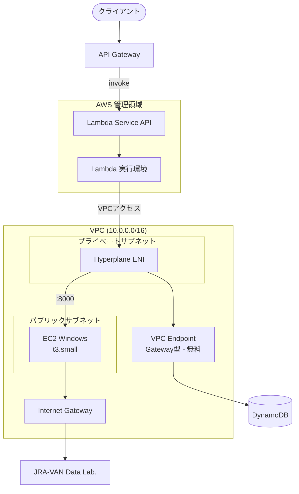

# システムアーキテクチャ

## 概要

馬券会議システムのインフラ構成。Lambda + API Gateway + DynamoDB のサーバーレス構成をベースに、
JRA-VAN Data Lab. 連携のための EC2 Windows を追加。

## アーキテクチャ図



> **Note**: Lambda は AWS 管理の VPC で実行され、Hyperplane ENI 経由でユーザー VPC 内のリソースにアクセスします。
> API Gateway からの呼び出しは Lambda Service API（パブリック）経由のため、Lambda の VPC 設定に関係なく動作します。

## コンポーネント

### API Gateway
- REST API エンドポイント
- CORS 設定済み

### Lambda 関数
- VPC 内（プライベートサブネット）に配置
- Python 3.12 ランタイム
- 各エンドポイントに対応した関数

| 関数名 | 用途 |
|--------|------|
| get-races | レース一覧取得 |
| get-race-detail | レース詳細取得 |
| add-to-cart | カートに追加 |
| get-cart | カート取得 |
| remove-from-cart | カートアイテム削除 |
| clear-cart | カートクリア |
| start-consultation | AI相談開始 |
| send-message | メッセージ送信 |
| get-consultation | 相談セッション取得 |

### DynamoDB
- Cart テーブル
- ConsultationSession テーブル
- VPC Gateway Endpoint 経由でアクセス（無料）

### EC2 Windows (JRA-VAN 連携用)
- **インスタンスタイプ**: t3.small (2 vCPU, 2 GiB)
- **OS**: Windows Server 2022
- **配置**: パブリックサブネット + Elastic IP
- **用途**: JV-Link (32bit COM) を動作させる FastAPI サーバー

## ネットワーク設計

### VPC
- CIDR: 10.0.0.0/16
- 2 AZ 構成

### サブネット

| 種類 | 用途 | 配置リソース |
|------|------|-------------|
| パブリック | インターネット接続 | EC2, NAT Gateway (不使用) |
| プライベート | 内部通信 | Lambda |

### セキュリティグループ

#### Lambda 用 SG
| 方向 | ポート | 宛先 | 用途 |
|------|--------|------|------|
| アウトバウンド | 8000 | EC2 SG | FastAPI 通信 |
| アウトバウンド | 443 | 0.0.0.0/0 | DynamoDB (VPC Endpoint) |

#### EC2 用 SG
| 方向 | ポート | ソース/宛先 | 用途 |
|------|--------|-------------|------|
| インバウンド | 8000 | Lambda SG | FastAPI |
| アウトバウンド | 443 | 0.0.0.0/0 | JRA-VAN, Windows Update |

## コスト見積もり

| リソース | 月額コスト |
|----------|-----------|
| Lambda | 実行時間による（ほぼ無料） |
| API Gateway | リクエスト数による |
| DynamoDB | オンデマンド（低コスト） |
| EC2 t3.small | ~$15 |
| EBS 50GB gp3 | ~$5 |
| Elastic IP | ~$4 (EC2 停止時のみ) |
| VPC Endpoint (DynamoDB) | **$0** (Gateway型) |
| NAT Gateway | **不使用** |
| **合計** | **約 $20-24/月** |

## NAT Gateway を使わない理由

### 問題
Lambda を VPC 内に配置すると、インターネットアクセスに NAT Gateway が必要（約 $32/月）

### 解決策
1. **DynamoDB**: VPC Gateway Endpoint（無料）
2. **EC2**: パブリックサブネット + Elastic IP
3. **Lambda ↔ EC2**: VPC 内通信

## デプロイモード

### モックモード（開発用）
```bash
cdk deploy BakenKaigiApiStack
```
- VPC 不要
- MockRaceDataProvider 使用

### JRA-VAN 連携モード（本番用）
```bash
cdk deploy --all --context jravan=true
```
- VPC + EC2 作成
- JraVanRaceDataProvider 使用

## 環境変数

| 変数名 | 値 | 説明 |
|--------|-----|------|
| RACE_DATA_PROVIDER | mock / jravan | プロバイダー選択 |
| JRAVAN_API_URL | http://x.x.x.x:8000 | EC2 の Private IP |
| CART_TABLE_NAME | baken-kaigi-cart | DynamoDB テーブル名 |
| SESSION_TABLE_NAME | baken-kaigi-consultation-session | DynamoDB テーブル名 |
