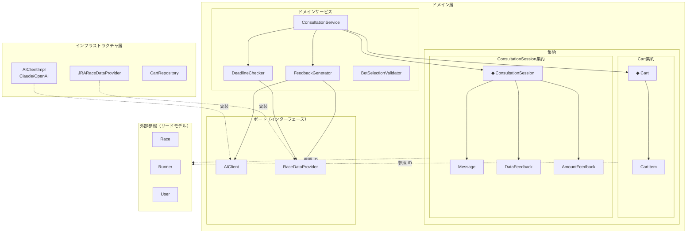
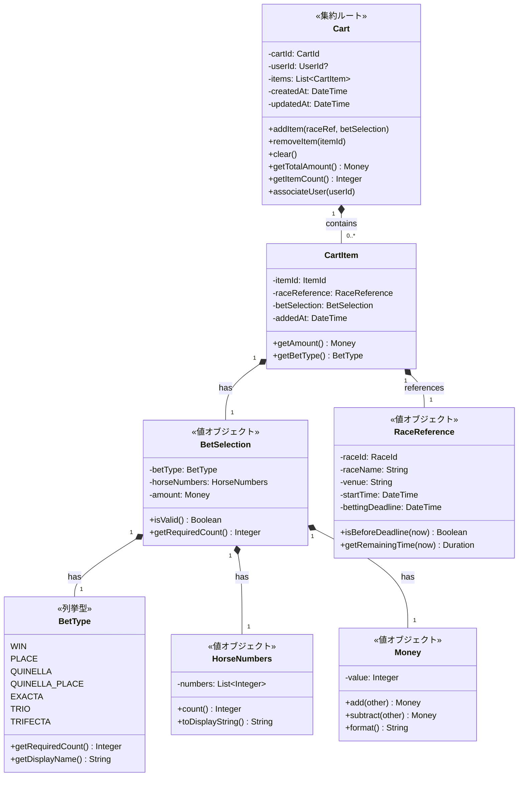
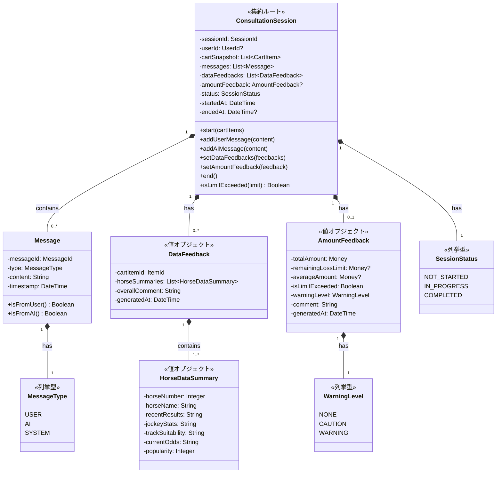
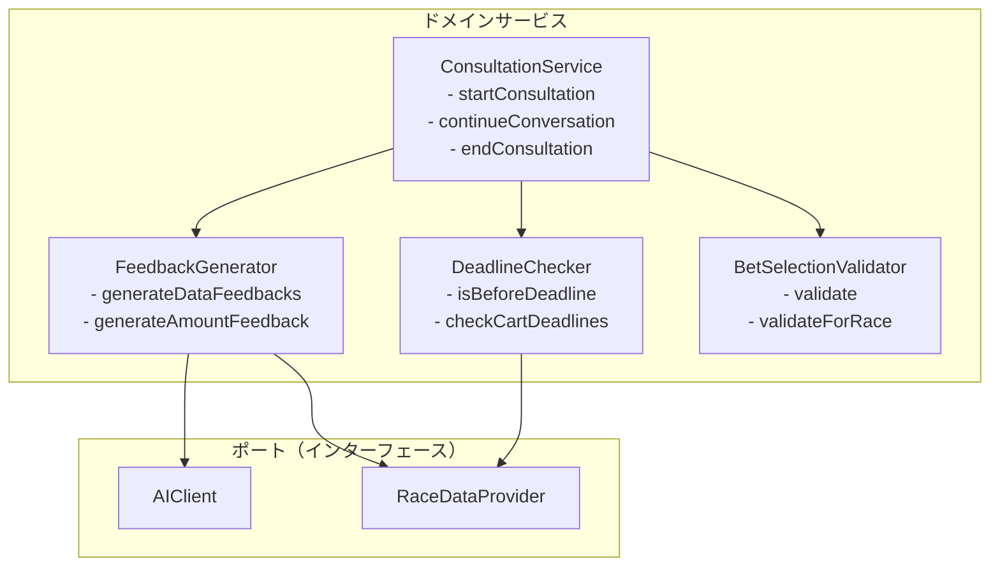
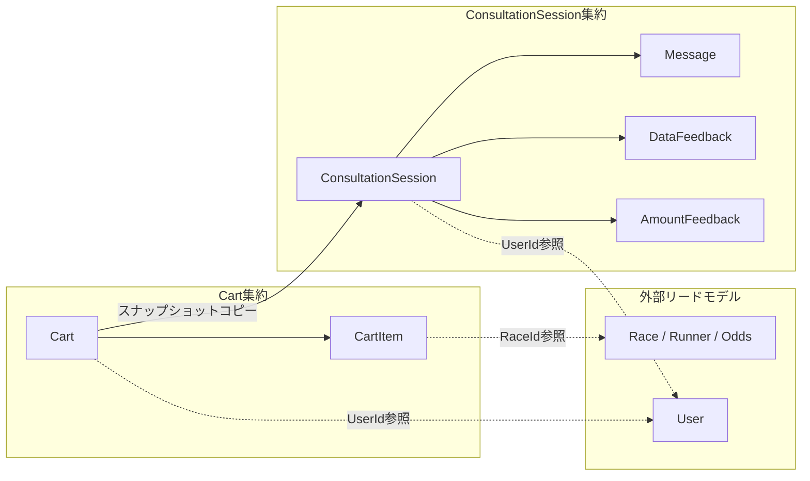
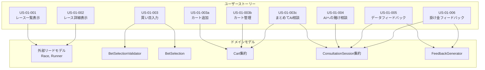
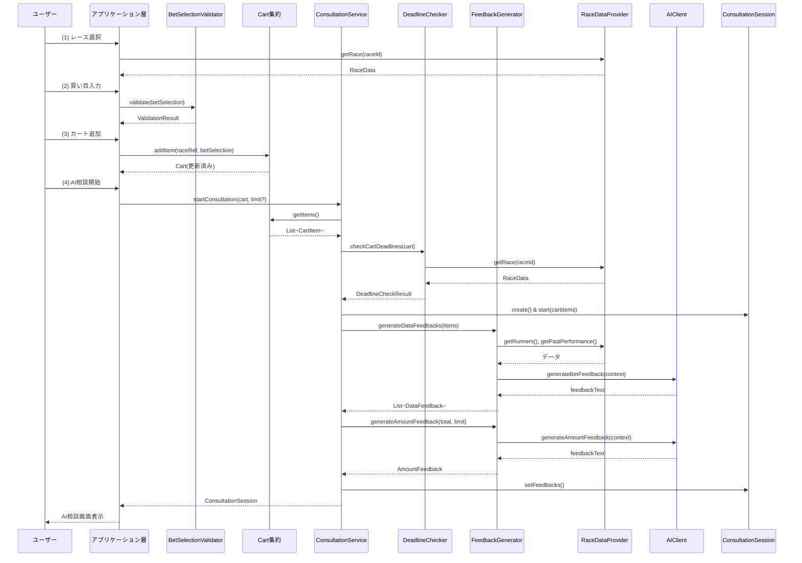
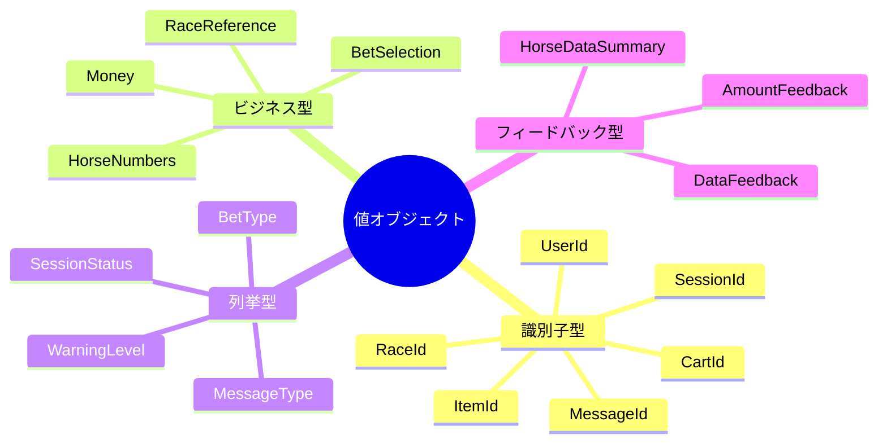

# ドメインモデル概要図

## Unit 1: AI対話機能（認証不要）

---

## 全体アーキテクチャ

---

## 集約詳細図

### Cart集約

### ConsultationSession集約

---

## ドメインサービスの依存関係

---

## 集約間の関係

---

## ユーザーストーリーとドメインモデルの対応

---

## 主要なデータフロー

### 買い目をカートに追加してAIに相談するフロー

---

## 値オブジェクト一覧

