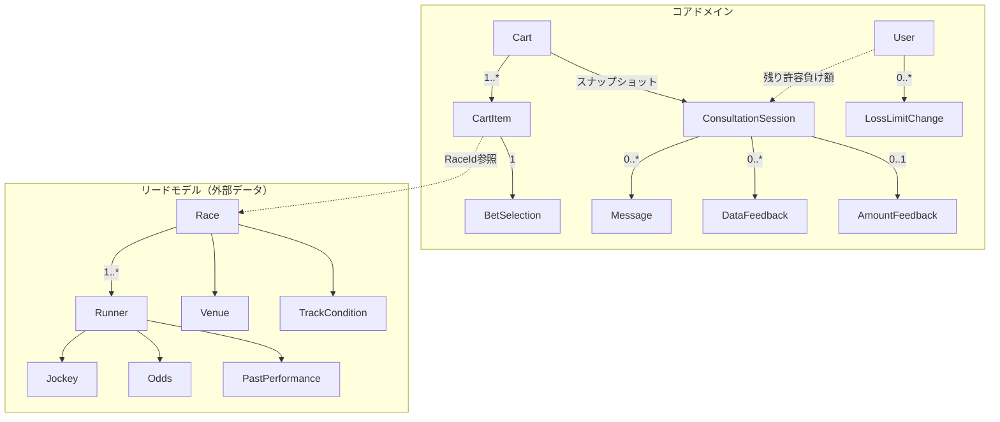

# ユビキタス言語（用語集）

## 概要

本ドキュメントは、Unit 1（AI対話機能・認証不要）のドメインモデルで使用する用語を定義します。

---

## ドメイン概念の分類

### コアドメイン（このシステムが管理する概念）

| 日本語 | 英語 | 説明 | 出典ストーリー |
|--------|------|------|---------------|
| 買い目 | BetSelection | ユーザーが購入を検討する馬券の内容（券種、馬番、金額） | US-01-003 |
| カート | Cart | 複数の買い目を一時的に保持するコンテナ | US-01-003a, 003b |
| カートアイテム | CartItem | カートに追加された個々の買い目 | US-01-003a |
| 相談セッション | ConsultationSession | AIとの相談の一連のやり取り | US-01-004 |
| メッセージ | Message | 相談セッション内の個々の発言（ユーザーまたはAI） | US-01-004 |
| データフィードバック | DataFeedback | 選択した馬に関するデータに基づくAIからの情報 | US-01-005 |
| 掛け金フィードバック | AmountFeedback | 掛け金額に対するAIからの情報・警告 | US-01-006 |
| ユーザー | User | 認証済みユーザー（限度額管理を含む） | US-02-001 |
| 限度額変更リクエスト | LossLimitChange | ユーザーの限度額変更申請 | US-02-002 |

### サポートドメイン（外部から取得するリードモデル）

| 日本語 | 英語 | 説明 | 出典ストーリー |
|--------|------|------|---------------|
| レース | Race | 競馬のレース（外部データ参照用） | US-01-001, 002 |
| 開催場 | Venue | レースが開催される競馬場 | US-01-001 |
| 出走馬 | Runner | レースに出走する馬の情報 | US-01-002 |
| 騎手 | Jockey | 馬に騎乗する騎手 | US-01-002 |
| オッズ | Odds | 馬券の配当率 | US-01-002 |
| 過去成績 | PastPerformance | 馬の過去のレース結果 | US-01-005 |
| 馬場状態 | TrackCondition | 馬場の状態（良、稍重、重、不良） | US-01-002 |

---

## 値の定義

### 券種（BetType）

| 値 | 説明 | 必要選択数 |
|----|------|-----------|
| 単勝 | 1着の馬を当てる | 1頭 |
| 複勝 | 3着以内に入る馬を当てる | 1頭 |
| 馬連 | 1着と2着の馬を当てる（順不同） | 2頭 |
| ワイド | 3着以内の2頭を当てる（順不同） | 2頭 |
| 馬単 | 1着と2着の馬を当てる（順序あり） | 2頭 |
| 三連複 | 1〜3着の馬を当てる（順不同） | 3頭 |
| 三連単 | 1〜3着の馬を当てる（順序あり） | 3頭 |

### 馬場状態（TrackCondition）

| 値 | 説明 |
|----|------|
| 良 | 乾いた良好な状態 |
| 稍重 | やや湿った状態 |
| 重 | 湿った状態 |
| 不良 | 非常に湿った状態 |

### メッセージ種別（MessageType）

| 値 | 説明 |
|----|------|
| ユーザー | ユーザーからの質問・入力 |
| AI | AIからの回答・フィードバック |
| システム | システムからの通知（締め切り警告など） |

---

## ビジネスルール関連用語

| 日本語 | 英語 | 説明 | 出典ストーリー |
|--------|------|------|---------------|
| 残り許容負け額 | RemainingLossLimit | ユーザーが設定した負け額限度額から現在の損失を引いた額 | US-01-003b, 003c, 006 |
| 合計掛け金 | TotalAmount | カート内の全買い目の金額合計 | US-01-003b, 003c |
| 投票締め切り | BettingDeadline | 馬券購入の締め切り時刻 | US-01-004 |
| 限度額超過 | LimitExceeded | 掛け金が残り許容負け額を超えている状態 | US-01-003c, 006 |
| 負け額限度額 | LossLimit | ユーザーが自身に設定する月間の負け額上限 | US-02-001 |
| 今月の累計損失額 | TotalLossThisMonth | 当月におけるユーザーの累計損失額 | US-02-001 |
| 限度額変更種別 | LossLimitChangeType | 限度額変更の種類（増額/減額） | US-02-002 |
| 限度額変更ステータス | LossLimitChangeStatus | 限度額変更リクエストの状態（待機中/承認済み/却下済み） | US-02-002 |
| 待機期間 | CoolingOffPeriod | 増額リクエストに適用される7日間の待機期間（依存症対策） | US-02-002 |
| 限度額チェック結果 | LossLimitCheckResult | 購入時の限度額に対する判定結果 | US-02-003 |
| 限度額接近アラート | LossLimitAlert | 限度額の80%に到達した際に表示される警告 | US-02-004 |
| 購入自動停止 | AutoStop | 限度額到達時に購入関連操作を無効化する機能 | US-02-003 |

---

## UI関連用語（参考）

| 日本語 | 英語 | 説明 |
|--------|------|------|
| トースト通知 | Toast | 一時的に表示される通知メッセージ |
| バッジ | Badge | アイコンに付与される数字表示 |
| プログレスバー | ProgressBar | 進捗を示すバー表示 |
| フィードバックカード | FeedbackCard | 買い目ごとのフィードバック表示領域 |

---

## ドメイン概念の関連図

---

## ストーリー別ドメイン概念マッピング

| ストーリー | 主要ドメイン概念 |
|-----------|-----------------|
| US-01-001 | Race, Venue（リードモデル） |
| US-01-002 | Race, Runner, Jockey, Odds, TrackCondition（リードモデル） |
| US-01-003 | BetSelection, BetType |
| US-01-003a | Cart, CartItem, BetSelection |
| US-01-003b | Cart, CartItem, TotalAmount, RemainingLossLimit |
| US-01-003c | Cart, ConsultationSession, DataFeedback, RemainingLossLimit |
| US-01-004 | ConsultationSession, Message, BettingDeadline |
| US-01-005 | DataFeedback, PastPerformance（リードモデル） |
| US-01-006 | AmountFeedback, TotalAmount, RemainingLossLimit |
| US-02-001 | User, LossLimit, TotalLossThisMonth |
| US-02-002 | LossLimitChange, LossLimitChangeType, CoolingOffPeriod |
| US-02-003 | LossLimitCheckResult, AutoStop |
| US-02-004 | LossLimitAlert, WarningLevel |
