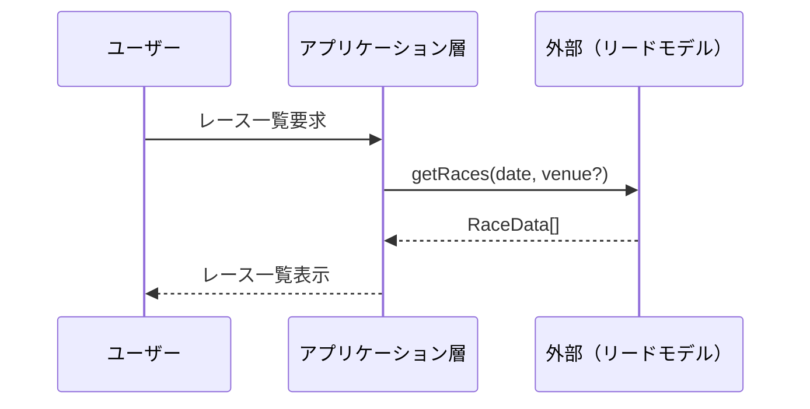
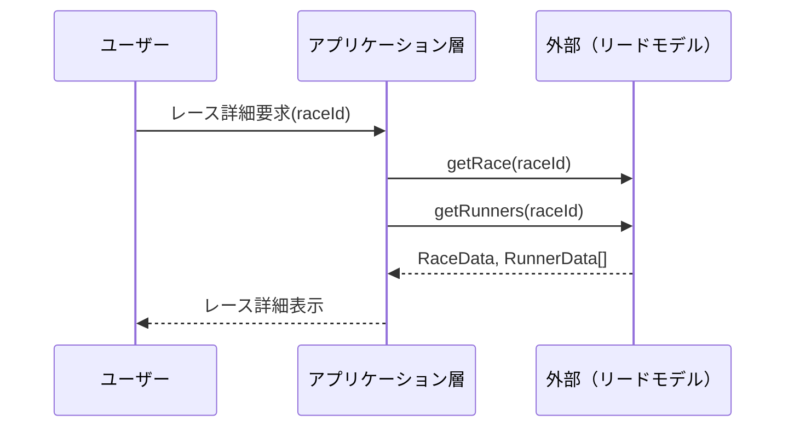
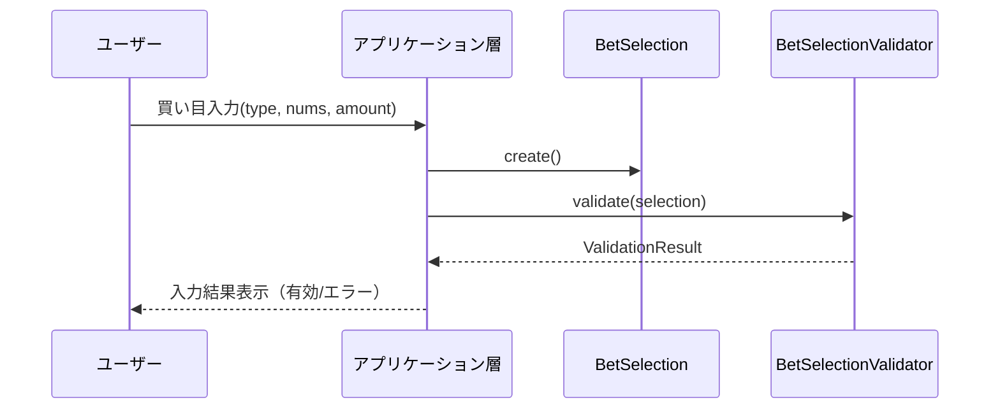
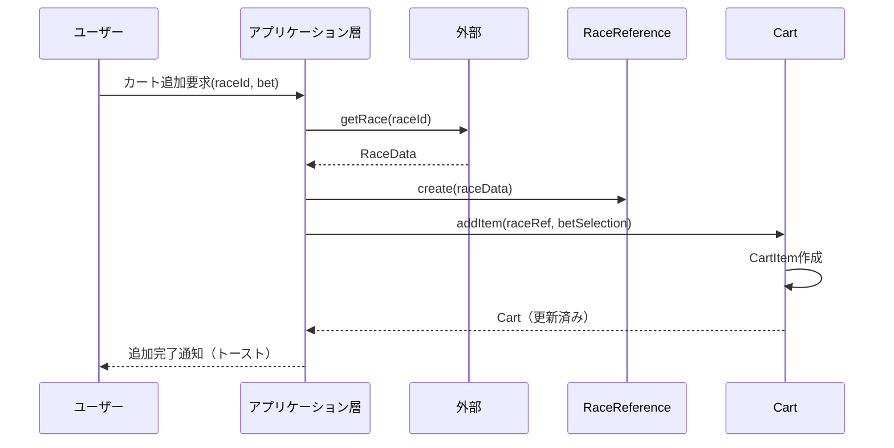
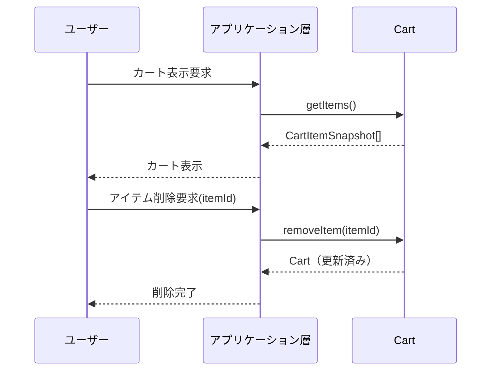
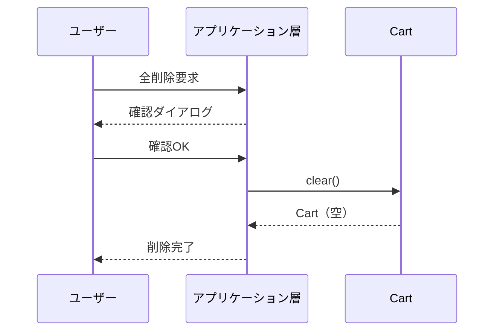
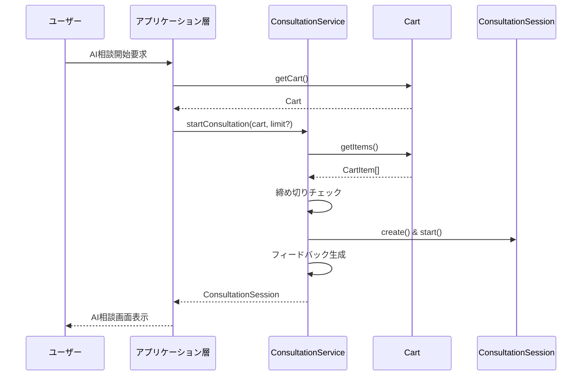
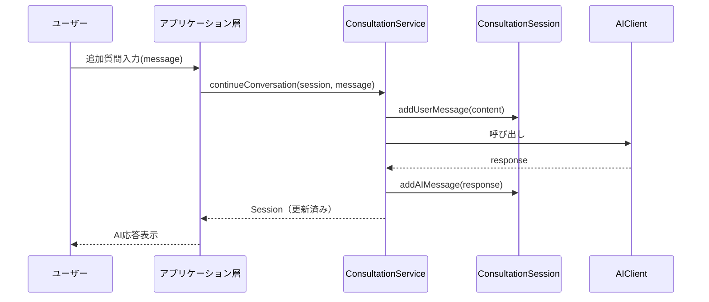
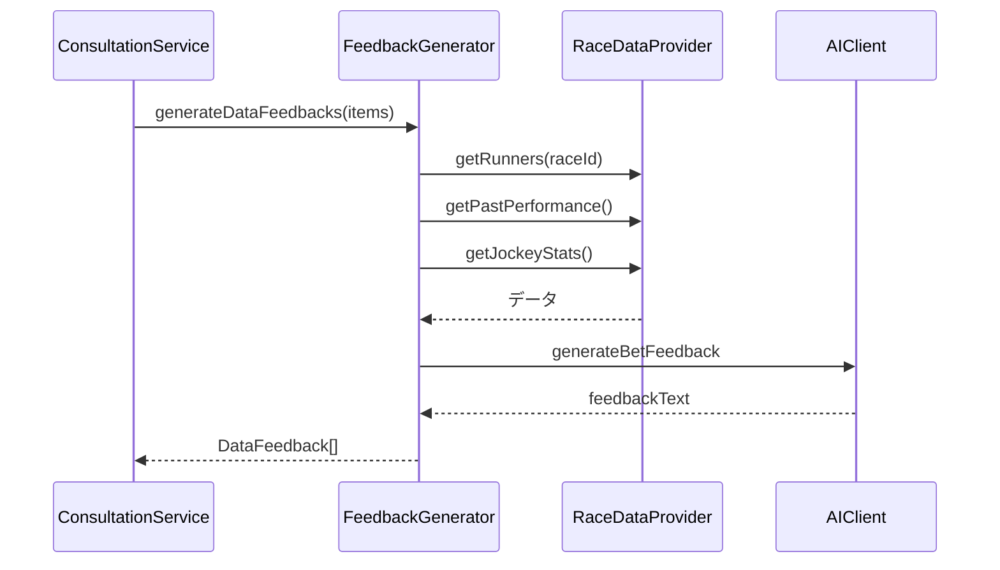
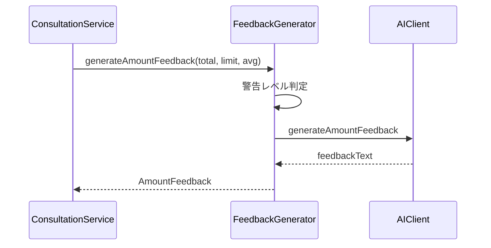

# ユースケースごとのドメインモデル相互作用

## 概要

本ドキュメントは、各ユーザーストーリーにおけるドメインオブジェクト間の相互作用を定義します。

---

## US-01-001: レース一覧の表示

### 概要
当日開催されるレースの一覧を表示する。

### ドメインモデル関与
**最小限**（外部リードモデルを参照するのみ）

### シーケンス



### 使用ドメインオブジェクト
- なし（外部リードモデルを直接参照）

### 備考
- レースデータはドメインモデル外として扱う決定に基づく
- アプリケーション層が外部データプロバイダーを直接利用

---

## US-01-002: レース詳細情報の表示

### 概要
特定のレースの出走馬、騎手、オッズなどの詳細情報を表示する。

### ドメインモデル関与
**最小限**（外部リードモデルを参照するのみ）

### シーケンス



### 使用ドメインオブジェクト
- なし（外部リードモデルを直接参照）

---

## US-01-003: 買い目の入力

### 概要
購入したい馬券の買い目（馬番、賭け式、金額）を入力する。

### ドメインモデル関与
**値オブジェクトの作成と検証**

### シーケンス



### 使用ドメインオブジェクト

| オブジェクト | 役割 |
|------------|------|
| BetSelection | 買い目を表現する値オブジェクト |
| BetType | 券種の列挙型 |
| HorseNumbers | 選択馬番の値オブジェクト |
| Money | 金額の値オブジェクト |
| BetSelectionValidator | 買い目の検証サービス |

### バリデーションルール
1. 券種が有効であること
2. 選択馬番の数が券種の要件を満たすこと
3. 金額が100円以上、100円単位であること

---

## US-01-003a: 買い目のカート追加

### 概要
入力した買い目をカートに追加する。

### ドメインモデル関与
**Cart集約の操作**

### シーケンス



### 使用ドメインオブジェクト

| オブジェクト | 役割 |
|------------|------|
| Cart | 集約ルート、買い目を保持 |
| CartItem | カート内のアイテム |
| BetSelection | 買い目の値オブジェクト |
| RaceReference | レース参照情報 |

### イベント
- CartItemAdded: アイテム追加時に発行

---

## US-01-003b: カートの管理

### 概要
カート内の買い目を確認・編集・削除する。

### ドメインモデル関与
**Cart集約の操作**

### シーケンス（アイテム削除）



### シーケンス（全削除）



### 使用ドメインオブジェクト

| オブジェクト | 役割 |
|------------|------|
| Cart | 集約ルート |
| CartItemSnapshot | 読み取り専用のアイテム情報 |
| Money | 合計金額の計算 |

### イベント
- CartItemRemoved: アイテム削除時
- CartCleared: 全削除時

---

## US-01-003c: 複数買い目のまとめてAI相談

### 概要
カート内の複数の買い目をまとめてAIに相談する。

### ドメインモデル関与
**相談セッションの開始**

### シーケンス



### 使用ドメインオブジェクト

| オブジェクト | 役割 |
|------------|------|
| Cart | 相談対象の買い目を保持 |
| ConsultationService | 相談セッションの開始を調整 |
| ConsultationSession | 新規作成される相談セッション |
| DeadlineChecker | 締め切りチェック |
| FeedbackGenerator | フィードバック生成 |

---

## US-01-004: AIへの賭け相談

### 概要
買い目についてAIに相談し、自由な会話を行う。

### ドメインモデル関与
**ConsultationSession集約の操作**

### シーケンス（追加質問）



### 使用ドメインオブジェクト

| オブジェクト | 役割 |
|------------|------|
| ConsultationSession | 会話を管理 |
| Message | 個々のメッセージ |
| ConsultationService | 会話の継続を調整 |

### イベント
- UserMessageAdded: ユーザーメッセージ追加時
- AIMessageAdded: AI応答追加時

---

## US-01-005: データに基づくフィードバック

### 概要
選んだ馬の過去成績、騎手情報などのデータに基づくフィードバックを表示する。

### ドメインモデル関与
**フィードバック生成と表示**

### シーケンス

（US-01-003cの相談開始時に自動実行）



### 使用ドメインオブジェクト

| オブジェクト | 役割 |
|------------|------|
| DataFeedback | 各買い目へのフィードバック |
| HorseDataSummary | 馬ごとのデータ要約 |
| FeedbackGenerator | フィードバック生成サービス |

### 表示内容
- 過去5走の成績
- 騎手の当該コース成績
- 馬場状態に対する適性
- 現在のオッズと人気順

---

## US-01-006: 掛け金に対するフィードバック

### 概要
入力した掛け金額に対するフィードバックを表示する。

### ドメインモデル関与
**掛け金フィードバック生成**

### シーケンス

（US-01-003cの相談開始時に自動実行）



### 使用ドメインオブジェクト

| オブジェクト | 役割 |
|------------|------|
| AmountFeedback | 掛け金フィードバック |
| Money | 金額の比較 |
| WarningLevel | 警告レベル |
| FeedbackGenerator | フィードバック生成サービス |

### 警告レベル判定

```
remainingLossLimit が設定されている場合:
  totalAmount / remainingLossLimit の比率で判定
  - < 80%  → NONE（警告なし）
  - >= 80% かつ < 100% → CAUTION（注意）
  - >= 100% → WARNING（警告）

remainingLossLimit がない場合（未ログイン）:
  - NONE（基本フィードバックのみ表示）
```

---

## ユーザーストーリーとドメインオブジェクトのマッピング

| ストーリー | 主要集約 | ドメインサービス | 値オブジェクト |
|-----------|---------|----------------|--------------|
| US-01-001 | - | - | - |
| US-01-002 | - | - | - |
| US-01-003 | - | BetSelectionValidator | BetSelection, BetType, HorseNumbers, Money |
| US-01-003a | Cart | - | BetSelection, RaceReference |
| US-01-003b | Cart | - | Money |
| US-01-003c | Cart, ConsultationSession | ConsultationService, FeedbackGenerator, DeadlineChecker | DataFeedback, AmountFeedback |
| US-01-004 | ConsultationSession | ConsultationService | Message |
| US-01-005 | ConsultationSession | FeedbackGenerator | DataFeedback, HorseDataSummary |
| US-01-006 | ConsultationSession | FeedbackGenerator | AmountFeedback, Money, WarningLevel |
