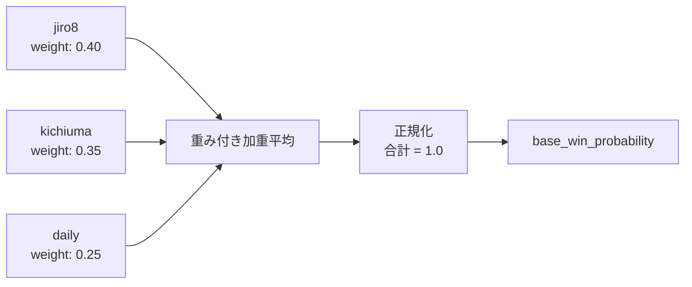
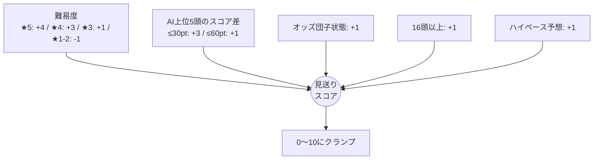
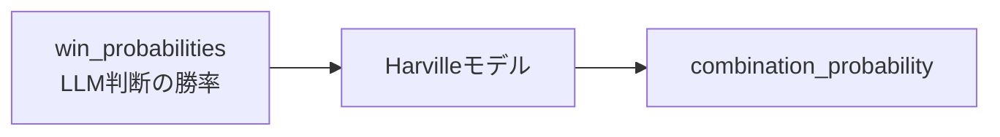
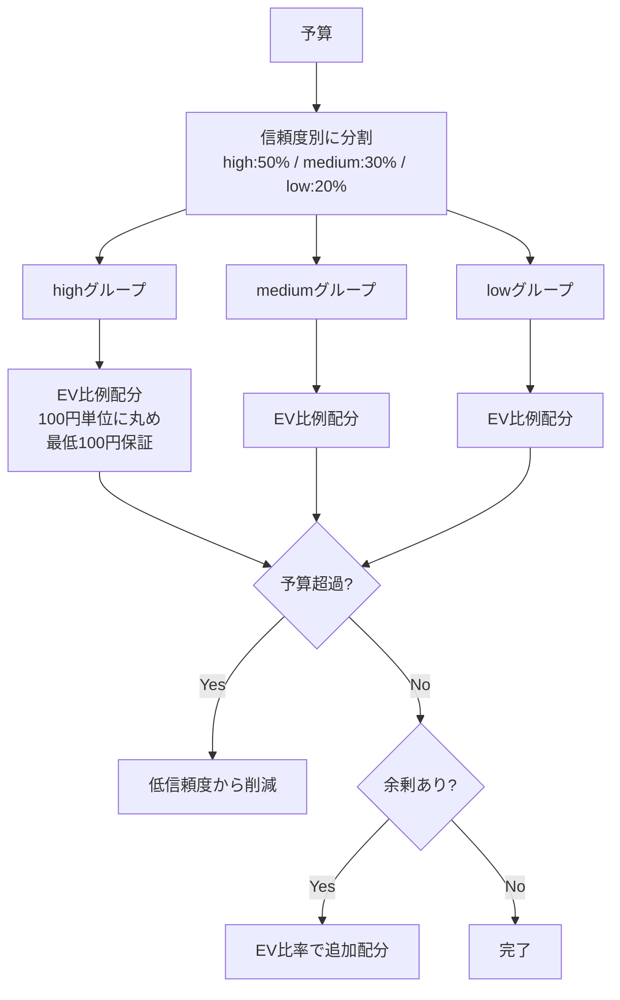

# 買い目提案ロジック

`analyze_race_for_betting` + `propose_bets` の2フェーズで買い目を生成するフロー。

## 全体フロー

```mermaid
flowchart TD
    START([ユーザー: 買い目提案して]) --> P0

    subgraph P0 [Phase 0: データ収集 + ベース確率算出]
        P0A[レース情報取得] --> P0B[AI予想取得]
        P0B --> P0C[脚質データ取得]
        P0C --> P0D[スピード指数取得]
        P0D --> P0E[近走成績取得]
        P0E --> P0F[AI予想スコア → ベース勝率算出]
    end

    P0 --> P1

    subgraph P1 [Phase 1: LLMによる勝率判断]
        P1A[ベース勝率を確認] --> P1B[ペース・脚質・指数・近走で調整]
        P1B --> P1C[最終的な win_probabilities を決定]
    end

    P1 --> P2

    subgraph P2 [Phase 2: 実オッズ取得]
        P2A[JRA-VAN API GET /races/{race_id}/odds] --> P2B[全7券種のオッズを取得]
    end

    P2 --> P3

    subgraph P3 [Phase 3: EV計算 + 買い目候補生成]
        P3A[全組合せの確率をHarvilleモデルで算出] --> P3B[確率 × 実オッズ = EV]
        P3B --> P3C{EV ≥ 1.0?}
        P3C -->|Yes| P3D[候補に追加]
        P3C -->|No| P3E[除外]
        P3D --> P3F[EV降順ソート → 上位N点を採用]
    end

    P3 --> P4

    subgraph P4 [Phase 4: 見送りゲート + 予算配分]
        P4A{見送りスコア ≥ 閾値?} -->|Yes| P4B[予算50%削減]
        P4A -->|No| P4C[予算そのまま]
        P4B --> P4D[予算配分]
        P4C --> P4D
    end

    P4 --> P5[Phase 5: ナレーション生成]
    P5 --> RESULT([提案結果を返却])
```

---

## Phase 0: データ収集 + ベース確率算出

`analyze_race_for_betting(race_id)` が実行する。

### データ収集

5つのデータソースからレース情報を取得する。

| データ | 取得元 | 主な項目 |
|--------|--------|----------|
| レース情報 | JRA-VAN API (EC2 FastAPI) | 出走馬、単勝オッズ、人気順、会場、レース条件 |
| AI予想 | DynamoDB `baken-kaigi-ai-predictions` | 馬番、スコア（0-100pt）、3ソース（jiro8/kichiuma/daily） |
| 脚質データ | JRA-VAN API `/races/{id}/running-styles` | 逃げ/先行/差し/追込/自在 |
| スピード指数 | DynamoDB `baken-kaigi-speed-indices` | 各馬のスピード指数（最新値・平均値） |
| 近走成績 | DynamoDB `baken-kaigi-past-performances` | 直近5走の着順 |

### AI予想スコアの重み付き統合 → ベース勝率

3ソースのAI予想スコアをソースごとの重みで統合し、各馬のベース勝率を算出する。



**計算手順**:

1. 各ソース内でスコアを正規化（score / sum → 確率）
2. ソース重みで加重平均
3. 再正規化して合計 1.0 に

**例**: 3頭レースでjiro8のスコアが [80, 50, 30] の場合:

```
jiro8内正規化: [0.50, 0.31, 0.19]
× jiro8重み(0.40): [0.20, 0.124, 0.076]
+ 他ソースの寄与分...
→ 最終正規化 → base_win_probability
```

### ペース予想

脚質データから逃げ馬の数をカウントし、ペースを判定する。

```
逃げ馬 3頭以上 → ハイペース（差し・追込有利）
逃げ馬 2頭    → ミドルペース（先行・差し有利）
逃げ馬 0〜1頭 → スローペース（逃げ・先行有利）
```

### ペース相性

予想ペースと馬の脚質の相性をマトリクスで評価し、LLMの判断材料として提供する。

相性値マトリクス（-1.0 〜 +1.0）:

| ペース＼脚質 | 逃げ | 先行 | 差し | 追込 | 自在 |
|---|---|---|---|---|---|
| **ハイ** | -1.0 | -0.5 | **+1.0** | **+1.0** | +0.5 |
| **ミドル** | 0 | +0.5 | +0.5 | 0 | +0.5 |
| **スロー** | **+1.0** | **+1.0** | -0.5 | -1.0 | +0.5 |

### 難易度判定

3カテゴリの要因から `upset_score` を計算し、★に変換する。

```
upset_score = 0

# 1. 頭数
16頭以上: +1  /  13〜15頭: +1  /  8頭以下: -1

# 2. レース条件
ハンデ戦: +2  /  障害戦: +2  /  新馬戦: +1  /  G1: -1  /  G2: -1

# 3. 会場
福島/中京/小倉: +1  /  京都/阪神: -1

# ★変換
difficulty_stars = clamp(upset_score + 2, 1, 5)
```

### 見送りスコア

複数の要因から見送りスコア（0〜10）を算出する。



### analyze_race_for_betting の出力

```python
{
    "race_info": {
        "race_id": "20260215_06_11",
        "race_name": "フェブラリーS",
        "venue": "東京",
        "distance": "1600",
        "surface": "ダ",
        "total_runners": 16,
        "difficulty": {               # _assess_race_difficulty() の戻り値
            "difficulty_stars": 2,
            "difficulty_label": "やや堅い",
            "upset_score": 0,
            "factors": ["16頭立ての多頭数レース（荒れやすい）", "G1（堅い傾向）"],
        },
        "predicted_pace": "ハイ",
        "skip_score": 3,
        "ai_consensus": "概ね合意",
        "confidence_factor": 1.0,
    },
    "horses": [
        {
            "number": 1,
            "name": "テスト馬1",
            "odds": 3.5,
            "base_win_probability": 0.18,  # AIソース重み付き統合
            "ai_scores": {"jiro8": 85, "kichiuma": 78, "daily": 72},
            "running_style": "先行",
            "pace_compatibility": 0.5,     # ペースとの相性値
            "speed_index": {"latest": 112, "avg": 108.5},
            "recent_form": [2, 1, 3, 5, 4],
        },
        ...
    ],
    "source_weights": {"jiro8": 0.40, "kichiuma": 0.35, "daily": 0.25},
}
```

---

## Phase 1: LLMによる勝率判断

LLMが `analyze_race_for_betting` の結果を見て、各馬の最終的な勝率（win_probabilities）を判断する。

**判断の指針**:

- `base_win_probability` をベースにする
- ペース予想と脚質の相性を考慮（ハイペース → 差し・追込UP、逃げDOWN）
- スピード指数が突出している馬の確率を上げる
- 近走成績が好調な馬の確率を上げる
- AI合議が「混戦」の場合は大きく調整しない
- **合計が 1.0 になるように正規化すること**

**出力例**:

```python
win_probabilities = {
    "1": 0.25,   # 1番馬: 25%
    "3": 0.18,   # 3番馬: 18%
    "7": 0.15,   # 7番馬: 15%
    ...          # 合計 = 1.0
}
```

---

## Phase 2: 実オッズ取得

`propose_bets` が呼ばれると、JRA-VAN API から全7券種の実オッズを取得する。

### API

`GET /races/{race_id}/odds`

### レスポンス

```python
{
    "race_id": "20260215_06_11",
    "win":            {"1": 3.5, "2": 5.8, ...},                  # 単勝
    "place":          {"1": {"min": 1.2, "max": 1.5}, ...},       # 複勝
    "quinella":       {"1-2": 64.8, "1-3": 155.2, ...},           # 馬連
    "quinella_place": {"1-2": 12.3, ...},                          # ワイド（odds_min を返す）
    "exacta":         {"1-2": 128.5, ...},                         # 馬単
    "trio":           {"1-2-3": 341.9, ...},                       # 三連複
    "trifecta":       {"1-2-3": 2048.3, ...}                       # 三連単
}
```

### データソース

| 券種 | JRA-VAN テーブル | パース仕様 |
|------|-----------------|-----------|
| 単勝・複勝 | jvd_o1 | 8文字/馬（単勝）、12文字/馬（複勝） |
| 馬連 | jvd_o2 | 13文字/組: kumiban(4) + odds(6, ÷10) + ninkijun(3) → `_parse_combination_odds_2h` |
| ワイド | jvd_o3 | 17文字/組: kumiban(4) + odds_min(5, ÷10) + odds_max(5, ÷10) + ninkijun(3) → `_parse_wide_odds` |
| 馬単 | jvd_o4 | 13文字/組: kumiban(4) + odds(6, ÷10) + ninkijun(3) → `_parse_combination_odds_2h` |
| 三連複 | jvd_o5 | 15文字/組: kumiban(6) + odds(6, ÷10) + ninkijun(3) |
| 三連単 | jvd_o6 | 15文字/組（同上） |

### オッズ参照キーの生成

券種によって馬番の並び順が異なる。

| 券種 | キー生成ルール | 例 |
|------|-------------|-----|
| 馬連・ワイド・三連複 | 昇順ソート | [3, 1] → `"1-3"` |
| 馬単・三連単 | 着順のまま | [3, 1] → `"3-1"` |
| 単勝 | 馬番のみ | [7] → `"7"` |

---

## Phase 3: EV計算 + 買い目候補生成

### 対象馬の絞り込み

LLMが判断した勝率のうち、`MIN_PROB_FOR_COMBINATION`（0.02 = 2%）以上の馬のみを組合せ対象とする。

### 組合せ生成

券種に応じて対象馬の全組合せを生成する。

| 券種 | 組合せ方法 | N頭の場合の組合せ数 |
|------|----------|------------------|
| 単勝・複勝 | 各馬単独 | N |
| 馬連・ワイド | C(N, 2) | N×(N-1)/2 |
| 馬単 | C(N, 2) ×勝率順 | N×(N-1)/2 |
| 三連複 | C(N, 3) | N×(N-1)×(N-2)/6 |
| 三連単 | C(N, 3) ×勝率順 | N×(N-1)×(N-2)/6 |

### 確率計算（Harvilleモデル）

LLMが判断した勝率から、Harvilleモデルで各組合せの的中確率を算出する。



**Harvilleモデル**:

条件付き確率を用いて、複数頭の着順確率を算出する。

```
# 馬単: A→Bの確率
P(A1着, B2着) = P(A) × P(B) / (1 - P(A))

# 三連単: A→B→Cの確率
P(A1着, B2着, C3着) = P(A) × P(B)/(1-P(A)) × P(C)/(1-P(A)-P(B))

# 馬連: A-Bの確率
P(馬連A-B) = P(A→B) + P(B→A)

# 三連複: A-B-Cの確率
P(三連複A-B-C) = Σ P(全6通りの着順)

# ワイド: A-Bの確率
P(ワイドA-B) = Σ_C P(3着内にA,Bが入る全パターン)
```

### 期待値（EV）計算

```
EV = 的中確率 × 実オッズ
```

| EV | 判定 |
|----|------|
| ≥ 1.5 | 信頼度 high |
| 1.2 〜 1.5 | 信頼度 medium |
| 1.0 〜 1.2 | 信頼度 low |
| < 1.0 | 除外（期待値マイナス） |

**具体例**: 1番馬(勝率25%)と2番馬(勝率18%)の馬連、実オッズ 64.8倍

```
# Harville馬単確率
P(1→2) = 0.25 × 0.18 / (1 - 0.25) = 0.060
P(2→1) = 0.18 × 0.25 / (1 - 0.18) = 0.055

# 馬連確率
P(馬連1-2) = 0.060 + 0.055 = 0.115

# EV
EV = 0.115 × 64.8 = 7.45  → 採用（high）
```

### 候補のソートと選定

1. EV ≥ 1.0 の組合せのみ候補に残す
2. EV 降順でソート
3. 上位 `max_bets`（デフォルト10点）を採用

---

## Phase 4: 見送りゲート + 予算配分

### 見送り判定

Phase 0 で算出された `skip_score` から `confidence_factor`（0.0〜2.0）を算出する。

**confidence_factor の算出**:

```
skip_score >= 9 → 0.0（完全見送り、買い目0点）
それ以外       → max(0.0, 2.0 - skip_score × 1.75 / 8)
```

| skip_score | confidence_factor | 状態 |
|------------|-------------------|------|
| 0 | 2.0 | 高信頼 |
| 4 | 1.125 | 通常 |
| 7 | 0.469 | 予算削減 |
| 9 | 0.0 | 完全見送り（買い目0点） |

budget モードでは `skip_score ≥ 7` で予算を50%に削減する。
bankroll モードでは `confidence_factor` を `race_budget` の算出に直接使用する。

### 予算配分

2つのモードがある。

#### budget モード（従来）

信頼度別グループに分割して配分する。



#### bankroll モード（ダッチング配分）

総資金（bankroll）からレースごとの予算を動的に計算する。

```
race_budget = bankroll × base_rate × confidence_factor
（上限: bankroll × MAX_RACE_BUDGET_RATIO）
```

ダッチング配分: 各買い目のオッズに反比例して配分する。

```
各買い目の金額 = race_budget × (1/odds_i) / Σ(1/odds_j)
```

---

## Phase 5: ナレーション生成

Haiku モデルを呼び出し、レース分析のナレーションを生成する。

**入力**: レース名、難易度★、ペース予想、AI合議レベル、見送りスコア、買い目リスト、出走馬データ

**出力**: `analysis_comment`（日本語のレース分析コメント）

生成に失敗した場合: `"EV分析に基づく提案。{N}点。"` のフォールバック。

---

## 定数一覧

| 定数 | 値 | 定義ファイル | 用途 |
|------|-----|------------|------|
| `EV_THRESHOLD` | 1.0 | ev_proposer.py | EV採用閾値 |
| `DEFAULT_BET_TYPES` | quinella, exacta, quinella_place, trio | ev_proposer.py | デフォルト券種 |
| `MIN_PROB_FOR_COMBINATION` | 0.02 | ev_proposer.py | 組合せ対象の最小確率 |
| `DEFAULT_MAX_BETS` | 10 | ev_proposer.py | 買い目の最大数 |
| `MIN_BET_AMOUNT` | 100 | bet_proposal.py | 最低掛け金（円） |
| `MAX_RACE_BUDGET_RATIO` | 0.1 | bet_proposal.py | bankrollモードの1レース上限比率 |
| `DEFAULT_BASE_RATE` | 0.03 | bet_proposal.py | bankrollモードの基本投資率 |
| `DEFAULT_SOURCE_WEIGHTS` | jiro8:0.40, kichiuma:0.35, daily:0.25 | race_analyzer.py | AI予想ソース重み |

---

## 関連ファイル

| ファイル | 役割 |
|---------|------|
| `backend/agentcore/tools/ev_proposer.py` | EVベース買い目提案（実オッズ取得・EV計算・予算配分） |
| `backend/agentcore/tools/race_analyzer.py` | レース分析（データ収集・ベース確率算出） |
| `backend/agentcore/tools/bet_proposal.py` | 予算配分ロジック・信頼度係数・ナレーション呼び出し |
| `backend/agentcore/tools/bet_analysis.py` | Harvilleモデル・券種名定義 |
| `backend/agentcore/tools/pace_analysis.py` | ペース予想・難易度判定 |
| `backend/agentcore/tools/risk_analysis.py` | 見送りスコア算出 |
| `backend/agentcore/tools/race_data.py` | レースデータ取得（JRA-VAN API） |
| `backend/agentcore/tools/ai_prediction.py` | AI予想取得（DynamoDB） |
| `backend/agentcore/tools/speed_index.py` | スピード指数取得（DynamoDB） |
| `backend/agentcore/tools/past_performance.py` | 近走成績取得（DynamoDB） |
| `backend/agentcore/prompts/bet_proposal.py` | エージェント用システムプロンプト |
| `jravan-api/database.py` | JRA-VAN DB オッズパーサー（get_all_odds） |
| `jravan-api/main.py` | JRA-VAN API エンドポイント（GET /races/{id}/odds） |
