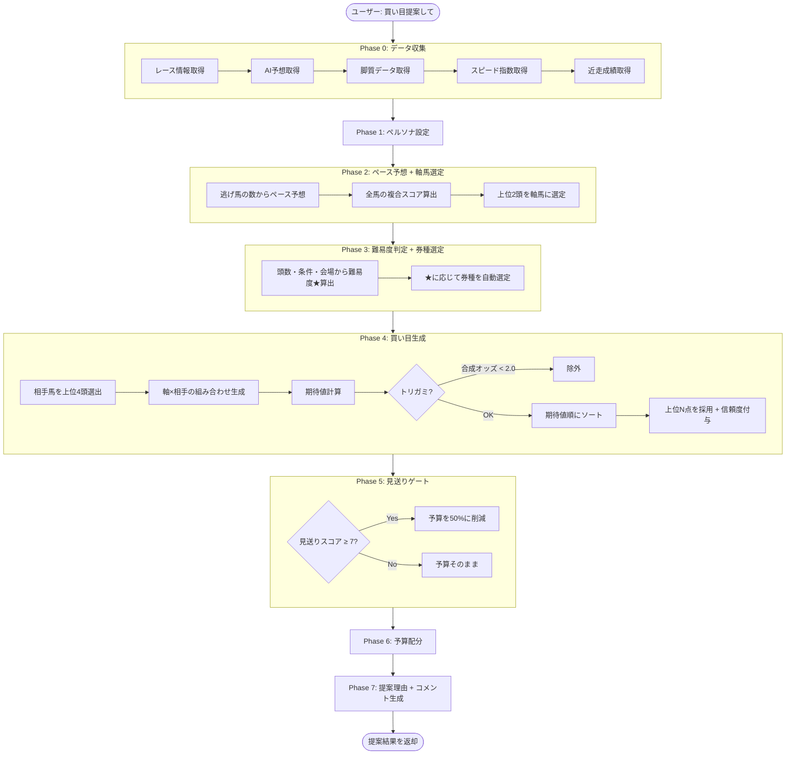
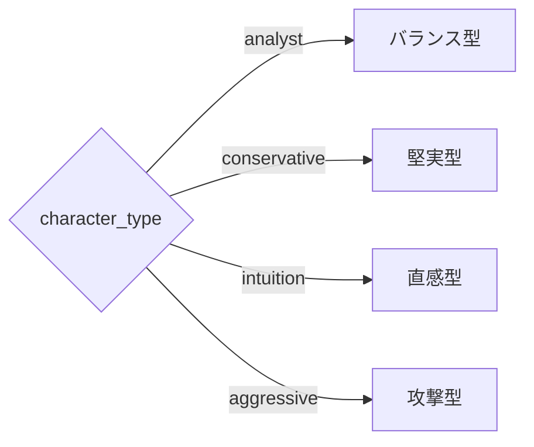
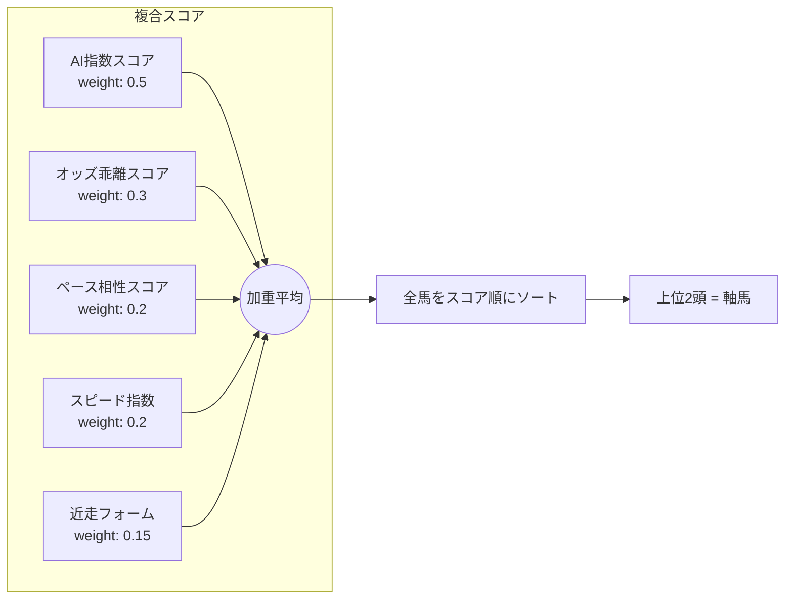
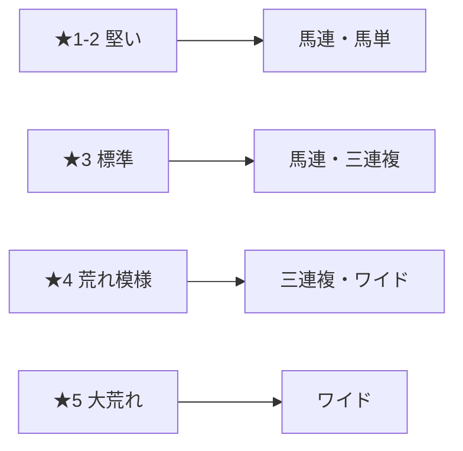
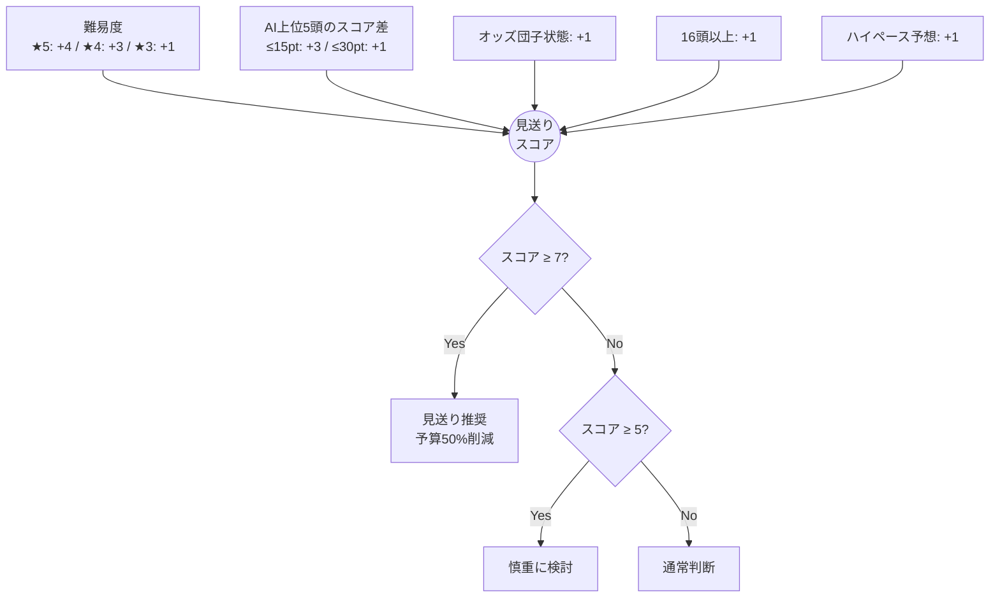
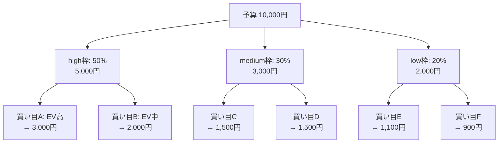

# 買い目提案ロジック

`generate_bet_proposal` ツールが買い目を生成するまでの全体フロー。

## 全体フロー



## Phase 0: データ収集

5つのデータソースからレース情報を取得する。

| データ | 取得元 | 主な項目 |
|--------|--------|----------|
| レース情報 | JRA-VAN API | 出走馬、オッズ、人気、会場、条件 |
| AI予想 | DynamoDB | 馬番、順位、スコア（複数ソース） |
| 脚質データ | JRA-VAN API | 逃げ/先行/差し/追込/自在 |
| スピード指数 | DynamoDB | 各馬のスピード指数 |
| 近走成績 | DynamoDB | 直近5走の着順 |

## Phase 1: ペルソナ設定

`character_type` に応じて各種パラメータを調整する。



| パラメータ | analyst | conservative | intuition | aggressive |
|-----------|---------|-------------|-----------|------------|
| AI重視度 | 0.5 | **0.6** | 0.3 | 0.3 |
| オッズ乖離重視度 | 0.3 | 0.2 | **0.5** | **0.5** |
| 高信頼への配分 | 50% | **60%** | 40% | 35% |
| 低信頼への配分 | 20% | **10%** | 30% | **40%** |
| トリガミ閾値 | 2.0 | **2.5** | 1.5 | 1.5 |
| 見送り閾値 | 7 | **6** | 8 | **9** |
| 最大点数 | 8 | **5** | 8 | 8 |
| 券種傾向 | バランス | ワイド寄り | 馬単/三連複 | 三連単 |

## Phase 2: ペース予想 + 軸馬選定

### ペース予想

```
逃げ馬 3頭以上 → ハイペース（差し・追込有利）
逃げ馬 2頭    → ミドルペース（先行・差し有利）
逃げ馬 0〜1頭 → スローペース（逃げ・先行有利）
```

### 軸馬の複合スコア

各馬に以下の重み付きスコアを算出し、上位2頭を軸馬に選定する。



**AI指数スコア**: AI順位1位=100pt、以降5ptずつ減少（18位=15pt）

**オッズ乖離スコア**: AI上位なのにオッズが高い馬にボーナス（市場の見落とし候補）

**ペース相性**: 予想ペースと脚質の相性マトリクス

| | 逃げ | 先行 | 差し | 追込 | 自在 |
|---|---|---|---|---|---|
| **ハイ** | -1.0 | -0.5 | **+1.0** | **+1.0** | +0.5 |
| **ミドル** | 0 | +0.5 | +0.5 | 0 | +0.5 |
| **スロー** | **+1.0** | **+1.0** | -0.5 | -1.0 | +0.5 |

**スピード指数**: レース内での順位を100〜15ptにマッピング

**近走フォーム**: 直近5走の着順を重み付き（5,4,3,2,1）で集計

## Phase 3: 難易度判定 + 券種選定

### 難易度スコア算出

```
upset_score = 0

# 頭数
16頭以上: +1  /  13〜15頭: +1  /  8頭以下: -1

# レース条件
ハンデ戦: +2  /  障害戦: +2  /  新馬戦: +1  /  G1: -1  /  G2: -1

# 会場
福島/中京/小倉: +1  /  京都/阪神: -1

# ★変換
difficulty_stars = clamp(upset_score + 2, 1, 5)
```

> LLMはこの★をベースラインの参考値として使い、AI予想の分散・ペース・
> 馬場・距離なども総合的に考慮してコメントする。

### 券種の自動選定



## Phase 4: 買い目生成

### 相手馬の選出

軸馬以外の全馬を複合スコア順にソートし、上位4頭を相手馬に選出。

### 組み合わせ生成

```
馬連/馬単/ワイドの場合:
  軸 × 相手 = 最大 2軸 × 4相手 = 8通り

三連複/三連単の場合:
  軸 × 相手2頭 = 最大 2軸 × C(4,2) = 12通り
```

### オッズ推定 → 期待値 → フィルタ

単勝オッズから各券種のオッズを推定する。

```
推定オッズ = 幾何平均(各馬の単勝オッズ) × 券種倍率
```

| 券種 | 倍率 |
|------|------|
| ワイド | 0.45 |
| 馬連 | 0.85 |
| 三連複 | 1.5 |
| 馬単 | 1.7 |
| 三連単 | 4.0 |

```
期待値 = 推定オッズ × JRA統計の推定的中率

合成オッズ < 2.0 → トリガミとして除外
```

残った買い目を期待値順にソートし、上位N点を採用。

### 信頼度の付与

採用した買い目を期待値順に3グループに分ける。

```
上位 1/3 → high
中位 1/3 → medium
下位 1/3 → low
```

## Phase 5: 見送りゲート

複数の要因から見送りスコア（0〜10）を算出する。



## Phase 6: 予算配分

信頼度グループごとに予算を配分し、期待値に応じて各買い目に分配する。



- 各グループ内では期待値に比例して配分
- 最低100円/点を保証
- 100円単位に丸め
- 余りは最も期待値の高い買い目に加算

## 定数一覧

| 定数 | 値 | 用途 |
|------|-----|------|
| MAX_AXIS_HORSES | 2 | 軸馬の最大数 |
| MAX_PARTNERS | 4 | 相手馬の最大数 |
| MAX_BETS | 8 | 買い目の最大数（デフォルト） |
| MIN_BET_AMOUNT | 100 | 最低掛け金（円） |
| TORIGAMI_THRESHOLD | 2.0 | 合成オッズがこれ未満で除外 |
| SKIP_GATE_THRESHOLD | 7 | 見送り推奨の閾値 |
| SKIP_BUDGET_REDUCTION | 0.5 | 見送り時の予算削減率 |

## 関連ファイル

| ファイル | 役割 |
|---------|------|
| `backend/agentcore/tools/bet_proposal.py` | 買い目提案の主ロジック |
| `backend/agentcore/tools/pace_analysis.py` | ペース予想・難易度判定 |
| `backend/agentcore/tools/risk_analysis.py` | 見送り判定 |
| `backend/agentcore/tools/bet_analysis.py` | 期待値・トリガミ計算 |
| `backend/agentcore/tools/race_data.py` | レースデータ取得 |
| `backend/agentcore/prompts/bet_proposal.py` | エージェント用プロンプト |
