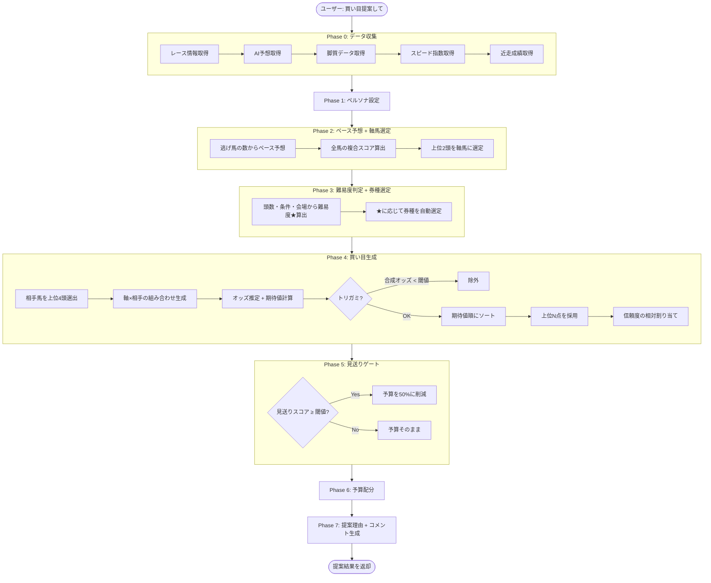
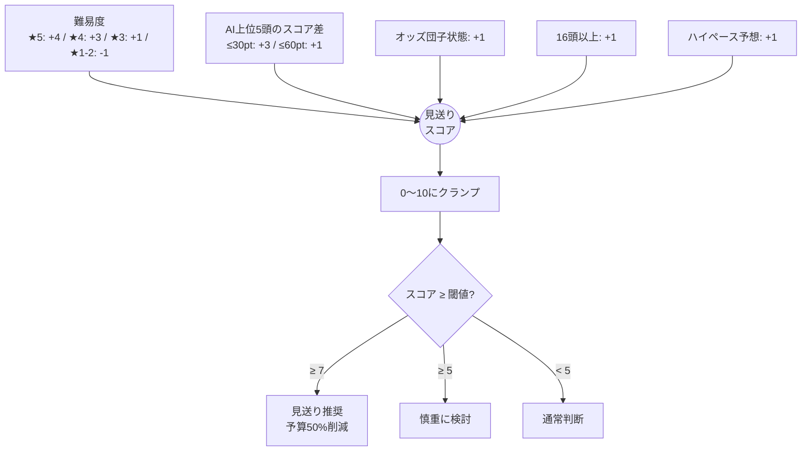

# 買い目提案ロジック

`generate_bet_proposal` ツールが買い目を生成するまでの全体フロー。

## 全体フロー



---

## Phase 0: データ収集

5つのデータソースからレース情報を取得する。

| データ | 取得元 | 主な項目 |
|--------|--------|----------|
| レース情報 | JRA-VAN API (EC2 FastAPI) | 出走馬、単勝オッズ、人気順、会場、レース条件 |
| AI予想 | DynamoDB `baken-kaigi-ai-predictions` | 馬番、順位、スコア（0-100pt） |
| 脚質データ | JRA-VAN API `/races/{id}/running-styles` | 逃げ/先行/差し/追込/自在 |
| スピード指数 | DynamoDB `baken-kaigi-speed-indices` | 各馬のスピード指数（複数ソース） |
| 近走成績 | DynamoDB `baken-kaigi-past-performances` | 直近5走の着順 |

データが取得できない場合（DynamoDBテーブルが空など）は、その成分を使わずに後続処理を行う（動的重み正規化で対応）。

---

## Phase 1: ペルソナ設定

`character_type` に応じて各種パラメータを調整する。デフォルト値をベースに、ペルソナ固有の設定で上書きする。


### パラメータ一覧

| パラメータ | analyst | conservative | intuition | aggressive |
|-----------|---------|-------------|-----------|------------|
| AI指数の重み `weight_ai_score` | 0.5 | **0.6** | 0.3 | 0.3 |
| オッズ乖離の重み `weight_odds_gap` | 0.3 | 0.2 | **0.5** | **0.5** |
| ペース相性の重み `weight_pace_compat` | 0.2 | 0.2 | 0.2 | 0.2 |
| スピード指数の重み `weight_speed_index` | 0.2 | 0.2 | 0.2 | 0.2 |
| 近走フォームの重み `weight_form` | 0.15 | 0.15 | 0.15 | 0.15 |
| 高信頼への配分 `allocation_high` | 50% | **60%** | 40% | 35% |
| 中信頼への配分 `allocation_medium` | 30% | 30% | 30% | **25%** |
| 低信頼への配分 `allocation_low` | 20% | **10%** | 30% | **40%** |
| トリガミ閾値 | 2.0 | **2.5** | 1.5 | 1.5 |
| 見送り閾値 | 7 | **6** | 8 | **9** |
| 最大点数 | 8 | **5** | 8 | 8 |

### 券種マッピング（難易度★別）

| 難易度 | analyst | conservative | intuition | aggressive |
|--------|---------|-------------|-----------|------------|
| ★1-2 | 馬連・馬単 | 馬連・ワイド | 馬単・馬連 | 馬単・三連単 |
| ★3 | 馬連・三連複 | ワイド・馬連 | 馬単・三連複 | 三連単・三連複 |
| ★4 | 三連複・ワイド | ワイド | 三連複・三連単 | 三連単・三連複 |
| ★5 | ワイド | ワイド | 三連複・ワイド | 三連複・三連単 |

---

## Phase 2: ペース予想 + 軸馬選定

### ペース予想

脚質データから逃げ馬の数をカウントし、ペースを判定する。

```
逃げ馬 3頭以上 → ハイペース（差し・追込有利）
逃げ馬 2頭    → ミドルペース（先行・差し有利）
逃げ馬 0〜1頭 → スローペース（逃げ・先行有利）
```

脚質データが取得できない場合、ペースは空文字（不明）となり、ペース相性スコアにはペナルティ（40pt）が適用される。

### 複合スコアの算出

各馬に5つのスコア成分を計算し、重み付き合算で複合スコア（0〜100pt）を算出する。

```mermaid
flowchart TD
    subgraph 5つのスコア成分
        AI[AI指数スコア<br>weight: 0.5]
        OG[オッズ乖離スコア<br>weight: 0.3]
        PC[ペース相性スコア<br>weight: 0.2]
        SI[スピード指数スコア<br>weight: 0.2<br>※データなし時は除外]
        FM[近走フォームスコア<br>weight: 0.15<br>※データなし時は除外]
    end

    AI --> NORM[動的重み正規化]
    OG --> NORM
    PC --> NORM
    SI -.->|データあり| NORM
    FM -.->|データあり| NORM

    NORM --> SCORE[複合スコア = Σ(スコア × 正規化重み)]
    SCORE --> RANK[全馬をスコア降順ソート]
    RANK --> TOP[上位2頭 = 軸馬]
```

#### 動的重み正規化

スピード指数・近走フォームはデータがない場合がある。データがある成分だけを使い、重みの合計が1.0になるよう正規化する。

```
例1: 5成分全てデータあり
  合計重み = 0.5 + 0.3 + 0.2 + 0.2 + 0.15 = 1.35
  AI正規化重み = 0.5 / 1.35 = 0.370
  オッズ乖離正規化重み = 0.3 / 1.35 = 0.222
  ...

例2: スピード指数・近走フォームなし（基本3成分のみ）
  合計重み = 0.5 + 0.3 + 0.2 = 1.0
  AI正規化重み = 0.5 / 1.0 = 0.500
  オッズ乖離正規化重み = 0.3 / 1.0 = 0.300
  ペース相性正規化重み = 0.2 / 1.0 = 0.200
```

---

### 成分1: AI指数スコア（0〜100pt）

AI予想データの順位からスコアに変換する。

```
AI指数スコア = max(0, 100 - (順位 - 1) × 5)
```

| AI順位 | スコア |
|--------|--------|
| 1位 | 100pt |
| 2位 | 95pt |
| 3位 | 90pt |
| 5位 | 80pt |
| 10位 | 55pt |
| 15位 | 30pt |
| 18位 | 15pt |
| 21位以上 | 0pt |

AI予想にヒットしない馬（`horse_number` が一致しない）は ai_rank=99 となり、スコア=0pt。

---

### 成分2: オッズ乖離スコア（20〜100pt）

AI順位と人気順位の乖離から「市場が見落としている馬」を検出する。

```mermaid
flowchart TD
    INPUT[AI順位 × 人気順位] --> C1{AI 5位以内 かつ<br>人気 6番以下?}
    C1 -->|Yes| BONUS[80 + (人気 - AI順位) × 2<br>上限100pt<br>市場の見落とし]
    C1 -->|No| C2{AI 3位以内 かつ<br>人気 3番以内?}
    C2 -->|Yes| NORM[60pt<br>順当評価]
    C2 -->|No| C3{AI 6位以下 かつ<br>人気 3番以内?}
    C3 -->|Yes| LOW[20pt<br>過剰人気]
    C3 -->|No| DEFAULT[50pt<br>標準]
```

**具体例**:

| ケース | AI順位 | 人気 | スコア | 意味 |
|--------|--------|------|--------|------|
| AI1位・10番人気 | 1 | 10 | 98pt | 市場が見落としている（妙味大） |
| AI2位・8番人気 | 2 | 8 | 92pt | 市場が見落としている |
| AI1位・1番人気 | 1 | 1 | 60pt | 順当（AI・市場一致） |
| AI8位・2番人気 | 8 | 2 | 20pt | 過剰人気（AIは低評価） |
| AI4位・6番人気 | 4 | 6 | 84pt | 市場の見落とし候補 |
| AI6位・6番人気 | 6 | 6 | 50pt | 標準 |

**人気データなし**の場合: デフォルト50pt（不確実性を反映）

---

### 成分3: ペース相性スコア（25〜75pt）

予想ペースと馬の脚質の相性をマトリクスで評価する。

```
ペース相性スコア = 50 + 相性値 × 25
```

相性値マトリクス（-1.0 〜 +1.0）:

| ペース＼脚質 | 逃げ | 先行 | 差し | 追込 | 自在 |
|---|---|---|---|---|---|
| **ハイ** | -1.0 → 25pt | -0.5 → 37.5pt | **+1.0 → 75pt** | **+1.0 → 75pt** | +0.5 → 62.5pt |
| **ミドル** | 0 → 50pt | +0.5 → 62.5pt | +0.5 → 62.5pt | 0 → 50pt | +0.5 → 62.5pt |
| **スロー** | **+1.0 → 75pt** | **+1.0 → 75pt** | -0.5 → 37.5pt | -1.0 → 25pt | +0.5 → 62.5pt |

- 脚質が「不明」or マトリクスにない場合: 相性値=0.0 → 50pt
- ペースデータなし **かつ** 脚質データなし: ペナルティ → 40pt

---

### 成分4: スピード指数スコア（15〜100pt）

DynamoDBから取得したスピード指数データを馬ごとに処理する。


**スコア変換**:

```
スコア = 100 - (順位 - 1) × 85 / (出走頭数 - 1)
```

| 順位（18頭中） | スコア |
|---------------|--------|
| 1位 | 100.0pt |
| 2位 | 95.0pt |
| 5位 | 80.0pt |
| 10位 | 55.0pt |
| 18位 | 15.0pt |

出走頭数が1頭の場合は100pt。データなしの場合は `None` を返し、複合スコア計算から除外される。

---

### 成分5: 近走フォームスコア（15〜100pt）

直近5走の着順を重み付き加重平均で評価する。最近の成績ほど重みが大きい。

**着順→スコア変換**:

| 着順 | スコア |
|------|--------|
| 1着 | 100pt |
| 2着 | 85pt |
| 3着 | 70pt |
| 4着 | 55pt |
| 5着 | 45pt |
| 6〜9着 | 30pt |
| 10着以降 | 15pt |

**重み（レーセンシー重み）**:

| 走順 | 重み |
|------|------|
| 直近1走前 | 5 |
| 2走前 | 4 |
| 3走前 | 3 |
| 4走前 | 2 |
| 5走前 | 1 |

**計算式**:

```
フォームスコア = Σ(着順スコア × 重み) / Σ(重み)
```

**例**: 直近5走が [1着, 3着, 2着, 5着, 8着] の場合:

```
= (100×5 + 70×4 + 85×3 + 45×2 + 30×1) / (5+4+3+2+1)
= (500 + 280 + 255 + 90 + 30) / 15
= 1155 / 15
= 77.0pt
```

---

### 軸馬の選定

1. ユーザーが `axis_horses` を指定 → その馬番を使用（出走馬に存在するもののみ）
2. 未指定 → 全馬の複合スコアを計算し、上位2頭を選定

```python
# 複合スコア降順でソート → 上位 MAX_AXIS_HORSES(=2) 頭
scored.sort(key=lambda x: x["composite_score"], reverse=True)
return scored[:2]
```

---

## Phase 3: 難易度判定 + 券種選定

### 難易度スコア算出

3カテゴリの要因から `upset_score` を計算し、★に変換する。

```
upset_score = 0

# 1. 頭数
16頭以上: +1  /  13〜15頭: +1  /  8頭以下: -1

# 2. レース条件
ハンデ戦: +2  /  障害戦: +2  /  新馬戦: +1  /  G1: -1  /  G2: -1

# 3. 会場
福島/中京/小倉: +1  /  京都/阪神: -1

# ★変換
difficulty_stars = clamp(upset_score + 2, 1, 5)
```

> **注意**: ★はベースラインの参考値。LLMはこの★に加え、AI予想のスコア分散（上位が僅差なら混戦、1頭抜けなら堅い）・ペース予想（ハイペースは前崩れで荒れやすい）・馬場（芝の方がダートより荒れやすい傾向）・距離（短距離はスピード勝負で波乱が起きやすい）を総合的に考慮してコメントする。

**★早見表の例**:

| 条件 | upset_score | ★ |
|------|------------|---|
| 東京G1・16頭 | +1(頭数) -1(G1) = 0 | ★2 |
| 福島ハンデ・16頭 | +1(頭数) +2(ハンデ) +1(福島) = +4 | ★5 |
| 阪神G2・12頭 | 0(頭数) -1(G2) -1(阪神) = -2 | ★1 |
| 中京未勝利・18頭 | +1(頭数) +1(中京) = +2 | ★4 |

### 券種の自動選定

ペルソナの `difficulty_bet_types` マッピングを参照して、難易度★から券種を自動選定する。ユーザーが `preferred_bet_types` を指定した場合はそちらを優先。


---

## Phase 4: 買い目生成

### 相手馬の選出

軸馬以外の全馬を複合スコア順にソートし、上位 `MAX_PARTNERS`(=4) 頭を相手馬に選出。

### 組み合わせ生成

券種に応じて軸馬×相手馬の組み合わせを生成する。

```
馬連/馬単/ワイドの場合:
  各軸 × 各相手 = 最大 2軸 × 4相手 = 8通り

  馬連: 馬番昇順で表示 (例: 3-7)
  馬単: 軸→相手の順 (例: 3→7)
  ワイド: 馬番昇順で表示 (例: 3-7)

三連複/三連単の場合:
  各軸 × C(4相手, 2) = 最大 2軸 × 6組 = 12通り

  三連複: 馬番昇順 (例: 1-3-7)
  三連単: 軸→相手1→相手2 (例: 1→3→7)
```

### オッズ推定

単勝オッズから各券種の推定オッズを算出する。


**幾何平均**:

```
2頭の場合: 幾何平均 = √(オッズA × オッズB)
3頭の場合: 幾何平均 = ∛(オッズA × オッズB × オッズC)
```

**券種別補正係数**:

| 券種 | 補正係数 | 根拠 |
|------|---------|------|
| ワイド `quinella_place` | 0.45 | 3着内なので的中率高く、オッズ低め |
| 馬連 `quinella` | 0.85 | 着順不問の2頭組み合わせ |
| 三連複 `trio` | 1.5 | 3頭組み合わせ・着順不問 |
| 馬単 `exacta` | 1.7 | 着順指定で馬連より高配当 |
| 三連単 `trifecta` | 4.0 | 着順指定3頭で高配当 |

**具体例**: 単勝10倍と単勝20倍の馬連

```
幾何平均 = √(10 × 20) = √200 ≈ 14.1
推定オッズ = 14.1 × 0.85 ≈ 12.0倍
```

### 期待値計算

推定オッズと統計的な的中確率から期待値を計算する。

```
期待値 = 推定オッズ × 推定的中率
```

**推定的中率の算出**:

1. 各馬の人気順位から JRA統計テーブルのベース確率を取得
2. 出走頭数による補正係数を適用（少頭数ほど上位人気が有利）
3. レース条件による補正係数を適用（ハンデ戦は荒れやすいなど）

**JRA統計テーブル（18頭基準）**:

| 人気 | 単勝率 | 複勝率 | 2着内率 |
|------|--------|--------|---------|
| 1番人気 | 33.0% | 65.0% | 52.0% |
| 2番人気 | 19.0% | 52.0% | 38.0% |
| 3番人気 | 13.0% | 43.0% | 30.0% |
| 5番人気 | 7.0% | 30.0% | 19.0% |
| 10番人気 | 2.0% | 10.0% | 6.0% |
| 18番人気 | 0.2% | 1.5% | 1.0% |

**出走頭数補正**: 8頭立ての1番人気は18頭立てより勝ちやすい。

| 頭数 | 1番人気 | 2番人気 | 3番人気 |
|------|---------|---------|---------|
| 8頭 | ×1.25 | ×1.20 | ×1.15 |
| 10頭 | ×1.15 | ×1.12 | ×1.10 |
| 14頭 | ×1.05 | ×1.04 | ×1.03 |
| 18頭 | ×1.00 | ×1.00 | ×1.00 |

中間頭数は線形補間。

**レース条件補正**:

| 条件 | 補正係数 | 傾向 |
|------|---------|------|
| G1 | 1.05 | 堅い |
| ハンデ戦 | 0.85 | 荒れやすい |
| 障害戦 | 0.80 | 荒れやすい |
| 新馬戦 | 0.88 | データ不足で荒れやすい |
| 通常 | 1.00 | - |

**期待値の評価**:

| 期待値 | 評価 |
|--------|------|
| ≥ 1.2 | 妙味あり |
| 0.9 〜 1.2 | 適正 |
| 0.7 〜 0.9 | やや割高 |
| < 0.7 | 割高 |

### トリガミチェック

推定オッズがトリガミ閾値未満の買い目を除外する。

```
推定オッズ < トリガミ閾値 → 除外

閾値はペルソナで異なる:
  analyst:      2.0倍
  conservative: 2.5倍（堅実なので厳しく）
  intuition:    1.5倍
  aggressive:   1.5倍
```

### 信頼度の相対割り当て

トリガミ除外後の買い目を期待値降順でソートし、上位N点を採用。その中で複合スコアに基づいて信頼度を相対的に割り当てる。


特殊ケース:
- 1件 → `high`
- 2件 → 上位 `high`、下位 `medium`

---

## Phase 5: 見送りゲート

複数の要因から見送りスコア（0〜10）を算出する。



見送り閾値はペルソナで異なる:
- conservative: 6（慎重派なので早めに見送り）
- analyst: 7
- intuition: 8
- aggressive: 9（攻撃型は見送りにくい）

**具体例**: 福島ハンデ・16頭・AI上位混戦・ハイペース予想

```
難易度★5 → +4
AI上位5頭差20pt → +3
オッズ団子 → +1
16頭 → +1
ハイペース → +1
合計 = 10 → 見送り推奨（予算50%削減）
```

---

## Phase 6: 予算配分

### 配分アルゴリズム


### 配分の詳細ルール

1. **グループ予算**: 存在するグループのみに配分し、比率を正規化
   - high のみ存在 → 100% が high に
   - high + low → high 71.4%, low 28.6%

2. **グループ内配分**: 期待値に比例して配分
   ```
   各買い目の金額 = グループ予算 × (その買い目のEV / グループ内EV合計)
   → 100円単位に丸め（切り捨て）
   → 最低100円を保証
   ```

3. **予算超過時**: 低信頼度の買い目から順に削減（最低100円は維持）

4. **余剰予算**: EV比率に応じて追加配分。丸め残りはEV最大の買い目に加算

5. **予算不足時**: 予算で買える最大点数 `= budget // 100` を超える場合、高信頼度順に絞り込み

---

## Phase 7: AI合議レベル + 提案理由

### AI合議レベル判定

AI予想の上位2頭のスコア差で合議レベルを判定する。

| 上位2頭のスコア差 | 合議レベル |
|------------------|-----------|
| ≥ 50pt | 明確な上位 |
| 20〜49pt | 概ね合意 |
| 10〜19pt | やや接戦 |
| < 10pt | 混戦 |

### 提案理由（proposal_reasoning）

4セクション構成で生成:

```
【軸馬選定】
  各軸馬のAI順位・スコア・総合評価・単勝オッズ・ペース相性を記載

【券種】
  難易度★に基づく選定理由 + AI指数差による補足

【組み合わせ】
  相手馬のAI順位・最大期待値を記載

【リスク】
  AI合議レベル・見送りスコア・トリガミリスクの有無
```

---

## 定数一覧

| 定数 | 値 | 用途 |
|------|-----|------|
| `MAX_AXIS_HORSES` | 2 | 軸馬の最大数 |
| `MAX_PARTNERS` | 4 | 相手馬の最大数 |
| `MAX_BETS` | 8 | 買い目の最大数（analyst デフォルト） |
| `MIN_BET_AMOUNT` | 100 | 最低掛け金（円） |
| `TORIGAMI_COMPOSITE_ODDS_THRESHOLD` | 2.0 | トリガミ閾値（analyst デフォルト） |
| `SKIP_GATE_THRESHOLD` | 7 | 見送り推奨の閾値（analyst デフォルト） |
| `SKIP_BUDGET_REDUCTION` | 0.5 | 見送り時の予算削減率 |
| `ODDS_GAP_BONUS_THRESHOLD` | 5 | オッズ乖離ボーナスのAI順位/人気閾値 |
| `WEIGHT_AI_SCORE` | 0.5 | AI指数の重み（analyst デフォルト） |
| `WEIGHT_ODDS_GAP` | 0.3 | オッズ乖離の重み |
| `WEIGHT_PACE_COMPAT` | 0.2 | ペース相性の重み |
| `WEIGHT_SPEED_INDEX` | 0.2 | スピード指数の重み |
| `WEIGHT_FORM` | 0.15 | 近走フォームの重み |
| `AI_SCORE_CLOSE_GAP` | 30 | 見送り: 混戦判定のスコア差 |
| `AI_SCORE_MODERATE_GAP` | 60 | 見送り: やや接戦判定のスコア差 |

---

## 関連ファイル

| ファイル | 役割 |
|---------|------|
| `backend/agentcore/tools/bet_proposal.py` | 買い目提案の主ロジック（複合スコア・軸馬選定・組み合わせ生成・予算配分） |
| `backend/agentcore/tools/bet_analysis.py` | 期待値計算・JRA統計確率テーブル・Harvilleモデル |
| `backend/agentcore/tools/pace_analysis.py` | ペース予想・難易度判定 |
| `backend/agentcore/tools/risk_analysis.py` | 見送り判定 |
| `backend/agentcore/tools/race_data.py` | レースデータ取得 |
| `backend/agentcore/tools/ai_prediction.py` | AI予想取得（DynamoDB） |
| `backend/agentcore/tools/speed_index.py` | スピード指数取得（DynamoDB） |
| `backend/agentcore/tools/past_performance.py` | 近走成績取得（DynamoDB） |
| `backend/agentcore/tools/constants.py` | 共通定数（閾値・係数） |
| `backend/agentcore/prompts/bet_proposal.py` | エージェント用システムプロンプト |
| `backend/agentcore/prompts/consultation.py` | 相談モード用プロンプト（難易度コメント指示含む） |
