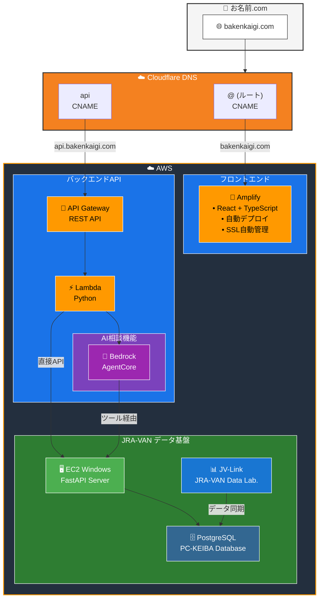

# ホスティング構成

## ドメイン

| 項目 | 値 |
|------|-----|
| ドメイン名 | bakenkaigi.com |
| レジストラ | お名前.com |
| 取得日 | 2026年1月 |

## DNS

| 項目 | 値 |
|------|-----|
| プロバイダ | Cloudflare（無料プラン） |
| 管理画面 | https://dash.cloudflare.com/ |

### レコード構成

| サブドメイン | 用途 | タイプ | 向き先 |
|-------------|------|--------|--------|
| `@`（ルート） | フロントエンド | CNAME | Amplify |
| `api` | バックエンドAPI | CNAME | API Gateway |

## フロントエンド（Amplify）

| 項目 | 値 |
|------|-----|
| URL | https://bakenkaigi.com |
| ホスティング | AWS Amplify |
| SSL証明書 | Amplify マネージド（自動更新） |
| デプロイ | main ブランチへのプッシュで自動デプロイ |

## バックエンドAPI（API Gateway）

| 項目 | 値 |
|------|-----|
| URL | https://api.bakenkaigi.com |
| サービス | API Gateway（REST API） |
| SSL証明書 | ACM（AWS Certificate Manager） |
| ステージ | prod |

## 構成図

## 備考

- www.bakenkaigi.com は未設定（必要に応じて後から追加可能）
- Cloudflare の Proxy は OFF（DNS only）に設定
